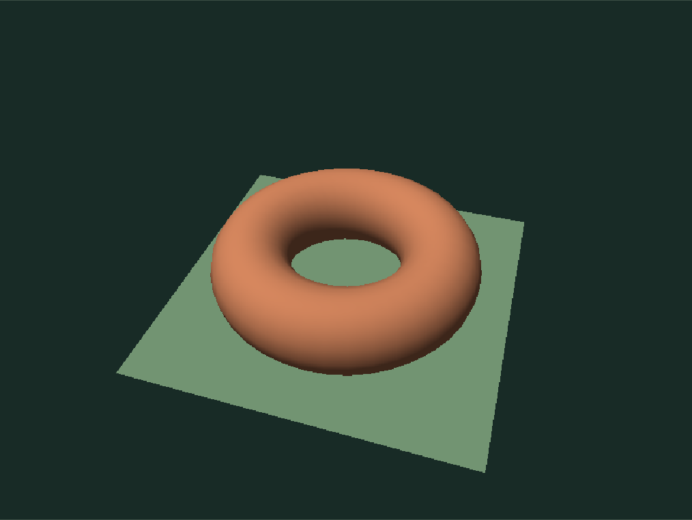
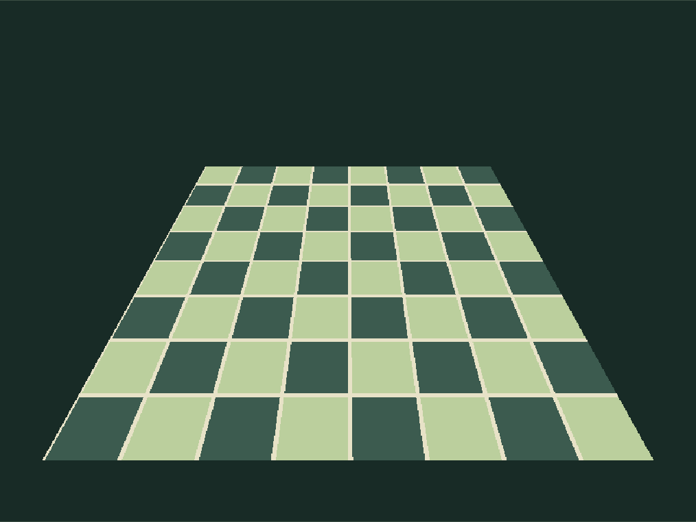

# Image Rasterizer

A small, inspectable software triangle renderer. Everything you see in the scene is produced by CPU code in a Web Worker and presented with Canvas 2D `ImageData`. It does not use WebGL, Three.js, an AI model, a server, or paid APIs.



## Run

Requires Node 22 or newer.

```sh
npm install
npm run dev
```

Open http://127.0.0.1:5183. On this workspace's Mac, select Node 22 first with `export PATH=/opt/homebrew/opt/node@22/bin:$PATH`.

```sh
npm test             # Numerical algorithm tests
npm run test:browser # Real Chromium interaction checks
npm run build        # Production Vite build
npm run capture      # Reproduce examples from the actual UI
```

If Chromium is not installed, run `npx playwright install chromium`. Capture starts its own local development server when needed and closes it afterward. No GitHub Actions workflows are included.

## Try it

- Orbit by dragging, using the camera sliders, or focusing the canvas and pressing arrow keys. Plus and minus adjust camera distance. Auto rotate is opt-in; Pause rotation stops it.
- Switch among Geometric still life, Smooth torus study, Perspective checker, and Overlapping meshes. The torus uses 1,280 triangles with analytic smooth normals and seam-correct UVs, plus a ground plane. The initial views keep the entire geometry inside the frame.
- Try Perspective checker with Perspective correction off to expose the two triangles' affine distortion. Nearest sample chooses one texel; Bilinear blend combines four.
- Inspect Shaded, Wireframe, Depth, Normals, and UV coordinate views. Resolution ranges from 160 × 120 to 800 × 600.
- Click a visible pixel, press I to inspect the center, or enter pixel coordinates and select Inspect. The inspector reads actual frame buffers and triangle data, including depth, screen barycentric weights, attribute weights, UVs, and RGB. Background pixels correctly have no triangle or depth.
- Load a local OBJ mesh or PNG/JPEG/WebP texture. Files remain in the browser. Export PNG downloads the exact rendered image at its selected resolution. Reset clears imported assets and restores the default scene.



## Pipeline

1. **Transform.** Rotate model positions and normals, translate into camera space, and apply a 45° perspective projection with near/far planes at 0.15 and 30 units.
2. **Clip.** Sutherland–Hodgman clips the polygon against all six `-w ≤ x,y,z ≤ w` planes in homogeneous coordinates. New vertices interpolate attributes before perspective division. Remaining polygons are triangulated.
3. **Cover pixels.** Divide by clip W and map to the raster viewport. Snap coordinates to a 1/256-pixel grid. Edge functions evaluate pixel centers, with a top-left tie rule so shared edges belong to exactly one triangle. Both windings render.
4. **Test depth.** Interpolate normalized device depth in screen space and retain the closest value in a float32 Z buffer. Depth is not incorrectly divided by W a second time.
5. **Shade.** Divide screen barycentric weights by clip W and renormalize for color, UVs, and normals. Sample the optional texture, then apply ambient plus directional Lambert lighting. All pixels are opaque.

`src/core/` holds pure, browser-independent algorithms. `src/assets/scenes.js` defines original procedural mesh assets. `src/render.worker.js` performs raster work and transfers the image, depth and triangle ID buffers to the UI. Inspection reuses this data; it does not render another frame.

Depth visualization maps camera distances of 2–10 units from light to dark. The inspector reports the actual normalized buffer value in `[0,1]`. Wireframe colors edges of the winning visible surface, so hidden edges are hidden. Statistics describe actual triangle counts, candidate sample bounds, visible pixels and measured worker CPU time; they are not a GPU timing or frame rate claim.

## Bounds and limitations

- At most 2,000 input triangles, 800 × 600 output pixels, and 24 million candidate samples per frame. The candidate budget is checked before pixel loops run. Reduce resolution or simplify the mesh if a view exceeds it.
- OBJ files: 2 MB maximum; 12,000 positions, UV coordinates, and normals each; 3–64 corners per face. Positive and negative face indices are supported. Missing UVs receive a triangle-local fallback, and missing normals become flat face normals. Models are centered and uniformly fitted to a 3-unit extent.
- Polygon faces must be planar, convex, and free of intersecting or collinear edges. Concave, nonplanar, self-intersecting and zero-area faces are rejected with useful errors; triangulate them in a modeling tool first. Materials, OBJ vertex-color extensions, lines, points and multiple object transforms are not supported.
- Textures: PNG, JPEG or WebP, up to 8 MB and 4,096 pixels per side. Header dimensions are checked before bitmap decoding; the accepted image is resized to at most 512 pixels per side. Transparent pixels composite over pale sage. UVs clamp to the texture boundary.
- One pixel-center sample; no antialiasing, mipmaps, gamma-correct filtering, backface culling, shadows, transparency, normal maps or material files. Highly detailed textures can alias. Shading works directly with display-encoded color values for an intentionally small educational pipeline.
- Raster requests debounce, stale work is terminated and ignored, and Cancel render stops the worker. Animation schedules the next frame only after the previous result, with a 90 ms minimum idle interval. Hidden/offscreen views pause work. Disposal terminates workers, aborts listeners, disconnects observers, clears timers and releases pointer capture.
- Mobile permits vertical page scrolling over the canvas. Camera sliders and arrow keys provide precise orbit control without requiring a drag gesture. Nothing auto-animates, including with reduced-motion preferences.

## Embed the same tool

```js
import { mountExperiment, metadata } from '@zachshotamartin/image-rasterizer';
import '@zachshotamartin/image-rasterizer/style.css';

const experiment = mountExperiment(container, { embedded: true });
// When removing the host view:
experiment.dispose();
```

`mountExperiment(element, options = {})` owns one DOM subtree and returns `{ dispose() }` synchronously. `embedded: true` omits its standalone heading for hosts that already provide a title; controls and rendering are identical. `assetBase` is accepted but unnecessary: the worker uses `new URL(..., import.meta.url)` and assets are packaged modules. CSS is scoped beneath `.image-rasterizer` and inherits the host font. Use a Vite-compatible module/worker build and allow worker loading in your host CSP.

## References

This is an original implementation informed by the standard pipeline and educational explanations, with no copied third-party source or external model/texture assets.

- [Khronos: vertex post-processing, clipping and perspective division](https://wikis.khronos.org/opengl/Perspective_Divide)
- [Khronos: OpenGL 2.1 specification](https://registry.khronos.org/OpenGL/specs/gl/glspec21.pdf), clipping and coordinate transformations.
- [Scratchapixel: rasterization stage, edge functions and coverage](https://www.scratchapixel.com/lessons/3d-basic-rendering/rasterization-practical-implementation/rasterization-stage.html)
- [Scratchapixel: practical rasterization implementation](https://www.scratchapixel.com/lessons/3d-basic-rendering/rasterization-practical-implementation/rasterization-practical-implementation.html), perspective-correct vertex attributes.

MIT licensed. Development dependencies retain their own licenses.
